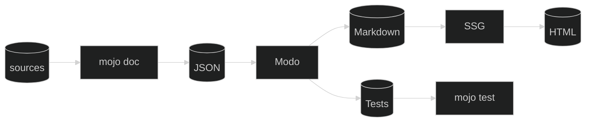

<style>
.reveal {
  font-size: 36px;
}
code {
  padding-left: 1rem;
  padding-right: 1rem;
}
</style>

# Modo🧯

<br />

DocGen for Mojo🔥

[<i class="fa fa-github"></i>](https://github.com/mlange-42/modo)

---

## What is Modo🧯?

### <big>&darr;</big>

----

This is not a Mojo🔥 project!

It is a project for Mojo🔥 projects.
<!-- .element: class="fragment" data-fragment-index="1" -->

<br />

Modo is a DocGen...
<!-- .element: class="fragment" data-fragment-index="2" -->

---

## Why I built Modo🧯

### <big>&darr;</big>

----

No standard tool for API docs so far

Need API docs for first(?) Mojo ECS: [Larecs](https://github.com/samufi/larecs)
<!-- .element: class="fragment" data-fragment-index="1" -->

Want simple, low-tech, generic solution
<!-- .element: class="fragment" data-fragment-index="2" -->

---

## What is does

### <big>&darr;</big>

----

From  `mojo doc`  JSON:
- creates a hierarchy of Markdown files suitable for SSGs
<!-- .element: class="fragment" data-fragment-index="1" -->
- converts code examples to unit tests
<!-- .element: class="fragment" data-fragment-index="2" -->

<br />
<br />


<!-- .element: class="fragment" data-fragment-index="3" -->

---

## Usage

#### Automatic mode

### <big>&darr;</big>

----

<!-- .slide: data-transition="convex-in none-out" data-auto-animate -->

### Add SMIL animation

Animate you SVG as usual

```html [3-4]
<svg width="500" height="250" ...>
  <circle cx="50" cy="50" r="10">
    <animate
      attributeName="r" to="40" dur="2s" fill="freeze" />
  </circle>
</svg>
```
<!-- .element: data-id="code-block" -->

----

<!-- .slide: data-transition="none" data-auto-animate -->

### Add SMIL animation

Animate you SVG as usual

Add a `data-fragment-index`

```html [4]
<svg width="500" height="250" ...>
  <circle cx="50" cy="50" r="10">
    <animate
      data-fragment-index="1"
      attributeName="r" to="40" dur="2s" fill="freeze" />
  </circle>
</svg>
```

<!-- .element: data-id="code-block" -->

----

<!-- .slide: data-transition="none" data-auto-animate -->

### Add SMIL animation

Animate you SVG as usual

Add a `data-fragment-index`

Set `begin="indefinite"`

```html [4-5]
<svg width="500" height="250" ...>
  <circle cx="50" cy="50" r="10">
    <animate
      data-fragment-index="1"
      begin="indefinite"
      attributeName="r" to="40" dur="2s" fill="freeze" />
  </circle>
</svg>
```
<!-- .element: data-id="code-block" -->

----

<!-- .slide: data-transition="none" data-auto-animate -->

###  That's it!

Fragments for control are automatically generated.

```html [4-5]
<svg width="500" height="250" ...>
  <circle cx="50" cy="50" r="10">
    <animate
      data-fragment-index="1"
      begin="indefinite"
      attributeName="r" to="40" dur="2s" fill="freeze" />
  </circle>
</svg>
```
<!-- .element: data-id="code-block" -->

SVG can be included directly, or as an external file using `<object>`

---

## Usage

#### Manual mode

### <big>&darr;</big>

----

<!-- .slide: data-transition="convex-in none-out" data-auto-animate -->

### Add SMIL animation

Again, animate you SVG as usual

```html [3-4]
<svg width="500" height="250" ...>
  <circle cx="50" cy="50" r="10">
    <animate
      attributeName="r" to="40" dur="2s" fill="freeze" />
  </circle>
</svg>
```
<!-- .element: data-id="code-block" -->

----

<!-- .slide: data-transition="none" data-auto-animate -->

### Add SMIL animation

Again, animate you SVG as usual

Add a `class` to the animation

```html [4]
<svg width="500" height="250" ...>
  <circle cx="50" cy="50" r="10">
    <animate
      class="first-animation"
      attributeName="r" to="40" dur="2s" fill="freeze" />
  </circle>
</svg>
```

<!-- .element: data-id="code-block" -->

----

<!-- .slide: data-transition="none-in convex-out" data-auto-animate -->

### Add SMIL animation

Again, animate you SVG as usual

Add a `class` to the animation

Set `begin="indefinite"`

```html [4-5]
<svg width="500" height="250" ...>
  <circle cx="50" cy="50" r="10">
    <animate
      class="first-animation"
      begin="indefinite"
      attributeName="r" to="40" dur="2s" fill="freeze" />
  </circle>
</svg>
```

<!-- .element: data-id="code-block" -->

----

### Add fragments

Use dummy fragments with `data-svg-classes` to control animations

```html
<span class="fragment" 
      data-svg-classes="first-animation"></span>
```

---

## Usage

#### Reverse animations

### <big>&darr;</big>

----

### Reverse animations

Add reverse versions of animations that are played when stepping backwards

----

### Reverse auto mode

Add animations with corresponding negative `data-fragment-index`

```html [3,7]
<circle cx="50" cy="50" r="10">
  <animate
        data-fragment-index="1"
        begin="indefinite"
        attributeName="r" to="40" dur="2s" fill="freeze" />
  <animate
        data-fragment-index="-1"
        begin="indefinite"
        attributeName="r" to="10" dur="2s" fill="freeze" />
</circle>
```

----

### Reverse manual mode

Add animations with class suffix `-revert`

```html [3,7]
<circle cx="50" cy="50" r="10">
  <animate
        class="first-animation"
        begin="indefinite"
        attributeName="r" to="40" dur="2s" fill="freeze" />
  <animate
        class="first-animation-revert"
        begin="indefinite"
        attributeName="r" to="10" dur="2s" fill="freeze" />
</circle>
```

---

## Installation

### <big>&darr;</big>

----

### Get the script

* Download file [reveal-svg-smil.js](https://raw.githubusercontent.com/mlange-42/reveal-svg-smil/main/reveal-svg-smil.js)
from the [GitHub repository](https://github.com/mlange-42/reveal-svg-smil)

Or

* Add [reveal-svg-smil](https://github.com/mlange-42/reveal-svg-smil) as git sub-module to your project

----

### Include the script

Load the script into your slideshow

```html
<script src="path/to/reveal-svg-smil.js"></script>
```

---

## Tips

### <big>&darr;</big>

----

### Non-SVG fragments

Use manual mode when you have non-SVG fragments on the same slide

--

Auto mode does not always work there (yet)

----

### Persistent state

Use `fill="freeze"` on an animation to make its state persistent after replay

Try it with **&darr;** **&uarr;**

<svg width="500" height="250">
  <circle cx="125" cy="125" r="20" fill="var(--r-main-color)">
    <animate
      data-fragment-index="1" 
      begin="indefinite"
      attributeName="r" to="100" dur="1.5s" />
    <animate
      data-fragment-index="-1" 
      begin="indefinite"
      attributeName="r" to="20" dur="1s" />
  </circle>
  <circle cx="375" cy="125" r="20" fill="var(--r-link-color)">
    <animate
      data-fragment-index="1" 
      begin="indefinite" fill="freeze"
      attributeName="r" to="100" dur="1.5s" />
    <animate
      data-fragment-index="-1" 
      begin="indefinite" fill="freeze"
      attributeName="r" to="20" dur="1s" />
  </circle>
Your browser does not support SVG.
</svg>

----

### Animation triggers

SMIL provides all kinds of triggers and timing.

We add slide navigation triggers on top, but you can still use all the power of SMIL
<!-- .element: class="fragment" data-fragment-index="1" -->

Click the circle to try it
<!-- .element: class="fragment" data-fragment-index="2" -->

<svg class="fragment" data-fragment-index="2" width="500" height="200">
  <circle cx="125" cy="100" r="20" fill="var(--r-link-color)">
    <animate id="pulse_1"
      attributeName="r" values="20; 40; 20" dur="1.5s" begin="click; move_2.end" repeatCount="3" />
    <animate id="move_1"
      attributeName="cx" to="375" dur="1.5s" begin="pulse_1.end" fill="freeze" />
    <animate id="pulse_2"
      attributeName="r" values="20; 40; 20" dur="1.5s" begin="move_1.end" repeatCount="3" />
    <animate id="move_2"
      attributeName="cx" to="125" dur="1.5s" begin="pulse_2.end" fill="freeze" />
  </circle>
Your browser does not support SVG.
</svg>

---

## reveal-svg-smil

Source code and documentation on [<i class="fa fa-github"></i> GitHub](https://github.com/mlange-42/reveal-svg-smil)
