<style>
.reveal {
  font-size: 36px;
}
p code, li code {
  padding-left: 0.5rem;
  padding-right: 0.5rem;
  background: #303030;
  border-radius: 0.2em;
}
.reveal .code-wrapper {
  width: 100%;
  margin-left: 0;
  margin-right: 0;
}
.reveal .code-wrapper code:not(.mermaid) {
	white-space: preserve;
  font-size: 120%;
  background: #303030;
  border-radius: 0.33em;
}
.reveal .code-wrapper code .nowrap {
  text-wrap: nowrap;
}
code.mermaid {
  text-align: center;
}
.reveal .slides section .fragment.step-fade-in-then-out {
	opacity: 0;
	display: none;
}
.reveal .slides section .fragment.step-fade-in-then-out.current-fragment {
	opacity: 1;
	display: inline;
}
.columns {
  display: flex;
}
.col {
  flex: 1;
  text-align: left;
  font-size: 90%;
}
</style>

# Modo🧯

<br />

### 🔥

---

## What is Modo🧯?

### <big>&darr;</big>

----

Modo🧯 is not a Mojo🔥 project!

It is a project for Mojo🔥 projects.
<!-- .element: class="fragment" data-fragment-index="1" -->

<br />

Modo🧯 is a DocGen for Mojo🔥, written in <i class="fa-brands fa-golang" style="font-size: 200%; position: relative; top: 12px; color: #00ADD8;"></i>
<!-- .element: class="fragment" data-fragment-index="2" -->

---

<!-- .slide: data-visibility="hidden" -->

## Why I built Modo🧯

### <big>&darr;</big>

----

<!-- .slide: data-visibility="hidden" -->

No standard tool for API docs so far

Need API docs for first(?) Mojo🔥 ECS: [Larecs](https://github.com/samufi/larecs)
<!-- .element: class="fragment" data-fragment-index="1" -->

Want simple, low-tech, generic solution
<!-- .element: class="fragment" data-fragment-index="2" -->

---

## What it does

### <big>&darr;</big>

----

From  `mojo doc`  JSON...
- creates Markdown files suitable for SSGs
- converts code examples to unit tests

<br />
<br />

<object type="image/svg+xml" data="flowchart.svg">
    
</object>

---

## Demo

<h3>&nbsp;</h3>

---

## Features

### <big>&darr;</big>

----

### Cross-references

Very simple syntax, resembling Mojo imports
<!-- .element: class="fragment" data-fragment-index="1" -->

<div><div class="columns"><div class="col">

```python
"""
Relative ref to [.Struct.method] in the current module.
"""
```

</div><div class="col" style="flex:0.1;"></div><div class="col">

Relative ref to [Struct.method]() in the current module.

</div></div></div>
<!-- .element: class="fragment" data-fragment-index="2" -->
<div><div class="columns"><div class="col">

```python
"""
Absolute ref to module [pkg.mod].
"""
```

</div><div class="col" style="flex:0.1;"></div><div class="col">

Absolute ref to module [mod]().

</div></div></div>
<!-- .element: class="fragment" data-fragment-index="3" -->
<div><div class="columns"><div class="col">

```python
"""
Ref with [pkg.mod custom text].
"""
```

</div><div class="col" style="flex:0.1;"></div><div class="col">

Ref with [custom text]().

</div></div></div>
<!-- .element: class="fragment" data-fragment-index="4" -->

----

### Re-exports

<div class="columns" style="align-items: center; justify-content: center;"><div class="col">

<pre style="width:100%; font-size: 0.65em;">
- pkg
  - mod
    - Struct
  - subpkg
    - submod
      - Trait
</pre>

</div><!-- .element: class="fragment" data-fragment-index="1" -->
<div class="col" style="flex:0.2;">

#### <i class="fa-solid fa-arrow-right"></i>

</div><!-- .element: class="fragment" data-fragment-index="2" -->
<div class="col" style="flex:2.0">

```python
"""
Package mypkg...

Exports:
 - mod.Struct
 - subpkg.submod.Trait
"""
from .mod import Struct
from .subpkg.submod import Trait
```

</div><!-- .element: class="fragment" data-fragment-index="2" -->
<div class="col" style="flex:0.2">

#### <i class="fa-solid fa-arrow-right"></i>

</div><!-- .element: class="fragment" data-fragment-index="3" -->
<div class="col">

Modo🧯

<pre style="width:100%; font-size: 0.65em;">
- pkg
  - Struct
  - Trait
</pre>

</div><!-- .element: class="fragment" data-fragment-index="3" -->
</div>

----

### Doc-tests

<div class="columns" style="align-items: center; justify-content: center;"><div class="col">

````python
"""
Doc-test example.

```mojo {doctest="sum"}
var a = 1 + 2
```

```mojo {doctest="sum" hide=true}
if a != 3:
    raise Error("failed")
```
"""
````

</div><!-- .element: class="fragment" data-fragment-index="1" -->
<div class="col" style="flex:0.4;">

#### <i class="fa-solid fa-arrow-right"></i>

</div><!-- .element: class="fragment" data-fragment-index="2" -->
<div class="col">


Doc-test example.

```python
var a = 1 + 2
```

<hr />

`..._test.mojo`

```python
fn test_sum() raises:
    var a = 1 + 2
    if a != 3:
        raise Error("failed")
```

</div><!-- .element: class="fragment" data-fragment-index="2" -->
</div>

----

### Scripts

Configure pre- and post-processing bash scripts

```yaml
# Bash commands to run before build as well as test.
pre-run:
  - |
    echo Running 'mojo doc'...
    magic run mojo doc -o docs/src/mypkg.json src/mypkg
    echo Done.
```
<!-- .element: class="fragment" data-fragment-index="1" -->

```yaml
# Bash scripts to run after test.
# Also runs after build if 'tests' is given.
post-test:
  - |
    echo Running 'mojo test'...
    magic run mojo test -I src docs/test
    echo Done.
```
<!-- .element: class="fragment" data-fragment-index="2" -->

----

### Templates

Highly customizable Markdown output through templates

```template
Mojo struct

# `{{.Name}}`

{{template "signature_struct" .}}

{{template "summary" . -}}
{{template "description" . -}}
{{template "aliases" . -}}
{{template "parameters" . -}}
{{template "fields" . -}}
{{template "parent_traits" . -}}
{{template "methods" . -}}
```
<!-- .element: class="fragment" data-fragment-index="1" -->

---

## How to get Modo🧯

### <big>&darr;</big>

----

#### Python/pip

`pip install pymodo`

<br/>

#### Go
<!-- .element: class="fragment" data-fragment-index="2" -->
`go install github.com/mlange-42/modo`
<!-- .element: class="fragment" data-fragment-index="2" -->
<br/>

#### Pre-compiled binaries
<!-- .element: class="fragment" data-fragment-index="3" -->
GitHub Releases
<!-- .element: class="fragment" data-fragment-index="3" -->

---

## @Modular

### <big>&darr;</big>

----

#### Please...

Specify cross-ref syntax <!-- .element: class="fragment" data-fragment-index="1" -->

Include package re-exports in JSON <!-- .element: class="fragment" data-fragment-index="2" -->

Support Markdown lists in <!-- .element: class="fragment" data-fragment-index="3" --> `Raises`<!-- .element: class="fragment" data-fragment-index="3" --> section

---

## Contributing

### <big>&darr;</big>

----

Feedback on tool and docs

"Playtest"
<!-- .element: class="fragment" -->

Make issues & PRs
<!-- .element: class="fragment" -->

---

## Thank you!

[<i class="fa fa-github"></i>/mlange-42/modo](https://github.com/mlange-42/modo)
