# Modo🧯

 

DocGen for Mojo🔥

[<i class="fa fa-github"></i>](https://github.com/mlange-42/modo)

---

## What is Modo🧯?

### <big>&darr;</big>

----

This is not a Mojo🔥 project!

It is a project for Mojo🔥 projects.
<!-- .element: class="fragment" data-fragment-index="1" -->

 

A DocGen for Mojo🔥, written in <i class="fa-brands fa-golang" style="font-size: 200%; position: relative; top: 12px; color: #00ADD8;"></i>
<!-- .element: class="fragment" data-fragment-index="2" -->

---

<!-- .slide: data-visibility="hidden" -->

## Why I built Modo🧯

### <big>&darr;</big>

----

<!-- .slide: data-visibility="hidden" -->

No standard tool for API docs so far

Need API docs for first(?) Mojo🔥 ECS: [Larecs](https://github.com/samufi/larecs)
<!-- .element: class="fragment" data-fragment-index="1" -->

Want simple, low-tech, generic solution
<!-- .element: class="fragment" data-fragment-index="2" -->

---

## What it does

### <big>&darr;</big>

----

From  `mojo doc`  JSON:
- creates Markdown files suitable for SSGs
<!-- .element: class="fragment" data-fragment-index="1" -->
- converts code examples to unit tests

```mermaid
graph LR
  sources[(Sources)]
  mojo_doc[mojo doc]
  JSON[(JSON)]
  Modo[Modo🧯]
  Markdown[(Markdown)]
  Tests[(Tests)]
  mojo_test[mojo test]
  HTML[(HTML)]

  sources-->mojo_doc
  subgraph cmd [modo build]
    mojo_doc-->JSON

    JSON-->Modo
    Modo-->Markdown
    Modo-->Tests

    Tests-->mojo_test
    Markdown-->SSG
  end
  SSG-->HTML
```

<!-- .element: class="fragment" data-fragment-index="2" -->

 
 

<!-- .element: class="fragment" data-fragment-index="3" -->

---

## Demo

---

## Features

### <big>&darr;</big>

----

#### Cross-references

----

#### Re-exports

----

#### Doc-tests

----

#### Scripts

----

#### Templates

---

## How to get Modo🧯

### <big>&darr;</big>

----

#### Python/pip

`pip install pymodo`

 

#### Go
<!-- .element: class="fragment" data-fragment-index="2" -->
`go install github.com/mlange-42/modo`
<!-- .element: class="fragment" data-fragment-index="2" -->
 

#### Pre-compiled binaries
<!-- .element: class="fragment" data-fragment-index="3" -->
GitHub Releases
<!-- .element: class="fragment" data-fragment-index="3" -->

---

## @Modular

### <big>&darr;</big>

----

- Specify cross-ref syntax <!-- .element: class="fragment" data-fragment-index="1" -->
- Include package re-exports into JSON <!-- .element: class="fragment" data-fragment-index="2" -->
- Bug: currently no signature for structs in JSON <!-- .element: class="fragment" data-fragment-index="3" -->
- Allow lists in <!-- .element: class="fragment" data-fragment-index="4" -->`Raises:` <!-- .element: class="fragment" data-fragment-index="4" -->

---

## Contributing

### <big>&darr;</big>

---

## Thank you!
